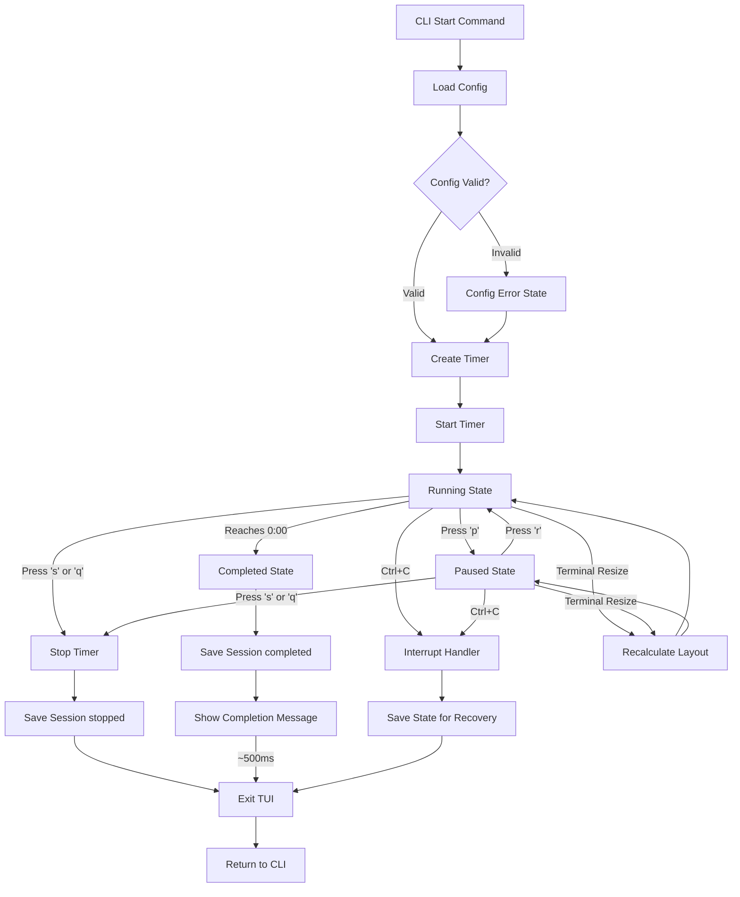

# Application Flows

**Version:** 1.0  
**Date:** 2026-01-27

## Overview

This document defines all user journeys, task flows, screen flows, and error/edge case flows for Pomodux. Flows show how users interact with the application and how screens transition between states.

**Source:** [Requirements User Stories](../requirements/base.md#epic-1-timer-management)

---

## Navigation Model

### Screen Structure

**Single-Screen TUI:**
- One view with state-based content
- No multi-screen navigation
- Same screen, different content based on timer state

**Entry Points:**
1. CLI command: `pomodux start <preset|duration> [label]`
2. State recovery: Resume from interrupted session (optional, configurable)

**Exit Points:**
1. Timer completion (auto-exit after ~500ms)
2. User stop (`s` or `q` key)
3. Emergency exit (`Ctrl+C`)

**Source:** [Requirements Section 8 TUI Specification](../requirements/base.md#tui-specification), [FR-TIMER-001](../requirements/base.md#fr-timer-001)

---

## Task Flows

### Flow 1: Start Timer with Preset

**Goal:** Start a timer using a named preset

**User Story:** [US-1.1](../requirements/base.md#us-11)

**Steps:**
1. User runs CLI: `pomodux start work "Implementing auth"`
2. Application loads config file
3. Application resolves preset "work" to duration (e.g., 25m)
4. Application creates timer with:
   - Duration: 25m (from preset)
   - Label: "Implementing auth" (user-provided)
   - Preset: "work"
5. Application starts timer
6. TUI displays running timer state
7. Timer counts down (updates every 250ms)
8. On completion:
   - Timer reaches 0:00
   - Session saved with `end_status: "completed"`
   - TUI shows completion message (~500ms)
   - Application exits

**Preconditions:**
- Config file exists (or defaults used)
- Preset "work" defined in config
- Valid label provided (or default used per [US-1.5](../requirements/base.md#us-15))

**Outcomes:**
- Timer running
- Session created (saved on completion)
- TUI displayed

**Wireframe Reference:** [Screen: Running State](screens.md#running-state)

**Requirements References:**
- [US-1.1](../requirements/base.md#us-11) - Start Timer with Preset
- [FR-TIMER-001](../requirements/base.md#fr-timer-001) - Timer Start
- [FR-CONFIG-002](../requirements/base.md#fr-config-002) - Timer Presets

---

### Flow 2: Start Timer with Custom Duration

**Goal:** Start a timer with arbitrary duration

**User Story:** [US-1.2](../requirements/base.md#us-12)

**Steps:**
1. User runs CLI: `pomodux start 45m "Client meeting"`
2. Application parses duration "45m"
3. Application validates duration (positive, max 24h)
4. Application creates timer with:
   - Duration: 45m (custom)
   - Label: "Client meeting" (user-provided)
   - Preset: "" (empty, custom duration)
5. Application starts timer
6. TUI displays running timer state
7. Timer counts down (updates every 250ms)
8. On completion:
   - Timer reaches 0:00
   - Session saved with `end_status: "completed"`
   - TUI shows completion message (~500ms)
   - Application exits

**Preconditions:**
- Valid duration format (e.g., "25m", "1h30m")
- Duration within limits (positive, max 24h)
- Valid label provided (or default "Generic timer session")

**Outcomes:**
- Timer running with custom duration
- Session created (saved on completion)
- TUI displayed

**Wireframe Reference:** [Screen: Running State](screens.md#running-state)

**Requirements References:**
- [US-1.2](../requirements/base.md#us-12) - Start Timer with Custom Duration
- [FR-TIMER-001](../requirements/base.md#fr-timer-001) - Timer Start

---

### Flow 3: Pause and Resume Timer

**Goal:** Pause timer, handle interruption, resume timer

**User Story:** [US-1.3](../requirements/base.md#us-13)

**Steps:**
1. Timer is running (e.g., 15:23 remaining)
2. User presses `p` key
3. Application pauses timer:
   - Timer state changes to "paused"
   - `pausedAt` set to current time
   - `pausedCount` incremented
   - State saved (event-driven)
4. TUI updates:
   - Status changes to "⏸ PAUSED" (yellow)
   - Progress bar freezes
   - Time display freezes at 15:23
   - Action Selection updates (shows `[r]esume  [s]top`)
5. User presses `r` key
6. Application resumes timer:
   - `totalPaused` updated with pause duration
   - `pausedAt` cleared
   - Timer state changes to "running"
   - State saved (event-driven)
7. TUI updates:
   - Status changes to "RUNNING" (green)
   - Progress bar continues
   - Time display resumes countdown
   - Action Selection updates (shows `[p]ause  [s]top`)

**Preconditions:**
- Timer is running (for pause)
- Timer is paused (for resume)

**Outcomes:**
- Timer state changes (running ↔ paused)
- Pause duration tracked
- UI updates immediately

**Wireframe References:**
- [Screen: Running State](screens.md#running-state)
- [Screen: Paused State](screens.md#paused-state)

**Requirements References:**
- [US-1.3](../requirements/base.md#us-13) - Pause and Resume Timer
- [FR-TIMER-002](../requirements/base.md#fr-timer-002) - Timer Pause/Resume

---

### Flow 4: Stop Timer Early

**Goal:** Stop timer before completion

**User Story:** [US-1.4](../requirements/base.md#us-14)

**Steps:**
1. Timer is running or paused (e.g., 10:15 remaining)
2. User presses `q` key (or `s` alias - both work)
3. **Timer is automatically paused** (if running, timer pauses; if paused, stays paused)
4. **Action Selection content changes:** "Stop timer and exit? [y]es / [n]o" (inline confirmation)
5. **User confirms or cancels:**
   - **Confirm (`y` or `Y`):**
     - Timer state changes to "stopped"
     - Session saved with `end_status: "stopped"`
     - Actual duration calculated (not full preset duration)
     - State file cleaned up
     - TUI exits immediately
     - User returns to command line
   - **Cancel (`n`, `N`, or `Esc`):**
     - Action Selection content changes back to state-appropriate actions
     - Timer resumes (unpauses and continues running from where it was) if it was running
     - Timer returns to previous state (running or paused)
     - User continues with timer

**Preconditions:**
- Timer is running or paused

**Outcomes:**
- Timer stopped
- Session saved
- Application exited

**Note:** 
- Inline confirmation prevents accidental stops
- User must explicitly confirm to stop timer
- Cancel returns to timer without changes
- No completion screen shown for stopped timer (immediate exit after confirmation)
- Confirmation happens within Action Selection component (no overlay)

**Requirements References:**
- [US-1.4](../requirements/base.md#us-14) - Stop Timer Early
- [FR-TIMER-003](../requirements/base.md#fr-timer-003) - Timer Stop

---

### Flow 5: Timer Completion

**Goal:** Timer reaches 0:00 and completes

**User Story:** [US-1.1](../requirements/base.md#us-11) (completion part)

**Steps:**
1. Timer is running
2. Timer reaches 0:00 (remaining time = 0)
3. Application completes timer:
   - Timer state changes to "completed"
   - Session saved with `end_status: "completed"`
   - Optional: Terminal bell rings (if `timer.bell_on_complete: true`)
   - State file cleaned up
4. TUI shows completion state:
   - Progress bar: 100% filled
   - Time: "0:00"
   - Status: "✓ COMPLETED" (green)
   - Message: "Session saved! Closing in 3." (countdown begins)
5. Countdown proceeds:
   - After 1 second: Message updates to "Session saved! Closing in 2."
   - After 2 seconds: Message updates to "Session saved! Closing in 1."
   - After 3 seconds: TUI exits
6. User returns to command line

**Preconditions:**
- Timer is running
- Remaining time reaches 0

**Outcomes:**
- Timer completed
- Session saved
- Application exited

**Wireframe Reference:** [Screen: Completed State](screens.md#completed-state)

**Requirements References:**
- [FR-TIMER-004](../requirements/base.md#fr-timer-004) - Timer Completion
- [UXDR: Auto-Exit Behavior](../uxdr/auto-exit-behavior.md) - Immediate exit
- [UXDR: Terminal Bell](../uxdr/terminal-bell-configuration.md) - Optional bell

---

### Flow 6: View Statistics (Separate Binary)

**Goal:** View session history and statistics

**User Story:** [US-3.1](../requirements/base.md#us-31), [US-3.2](../requirements/base.md#us-32)

**Note:** This is a separate binary (`pomodux-stats`), not part of TUI flow. Documented here for completeness.

**Steps:**
1. User runs: `pomodux-stats` or `pomodux-stats --today`
2. Application loads history file
3. Application filters sessions (if flag provided):
   - `--today`: Current day only
   - `--limit N`: Last N sessions
   - `--all`: All sessions
4. Application displays:
   - Session list (tabular) OR
   - Daily statistics (if `--today`)
5. User views output
6. Application exits

**Preconditions:**
- History file exists (or empty history)

**Outcomes:**
- Session list or statistics displayed
- Application exited

**Requirements References:**
- [US-3.1](../requirements/base.md#us-31) - View Recent Sessions
- [US-3.2](../requirements/base.md#us-32) - View Daily Statistics
- [FR-HISTORY-002](../requirements/base.md#fr-history-002) - Session Listing
- [FR-HISTORY-003](../requirements/base.md#fr-history-003) - Daily Statistics

---

## Screen Flows

### Screen Flow Diagram



### Screen States

**Primary States:**
1. **Running** - Timer counting down
2. **Paused** - Timer frozen
3. **Completed** - Timer reached 0:00 (brief display)

**Error States:**
4. **Terminal Too Small** - Terminal below minimum size (80x24)
5. **Config Errors** - Configuration validation errors

**Note:** Stopped state has no screen (immediate exit)

**Source:** [Requirements Section 8.1 Screen Layouts](../requirements/base.md#screen-layouts)

---

## Error Flows

### Error Flow 1: Invalid Preset

**Scenario:** User references undefined preset

**Steps:**
1. User runs: `pomodux start invalidpreset`
2. Application loads config
3. Application checks preset "invalidpreset"
4. Preset not found in config
5. Application displays error message:
   ```
   Error: preset 'invalidpreset' not found in config
   Usage: pomodux start <duration|preset> [label]
   Run 'pomodux --help' for usage
   ```
6. Application exits with error code 2 (usage error)

**Error Handling:**
- Clear error message
- Suggests correct usage
- Exits gracefully

**Requirements References:**
- [FR-CONFIG-002](../requirements/base.md#fr-config-002) - Timer Presets

---

### Error Flow 2: Invalid Duration Format

**Scenario:** User provides invalid duration format

**Steps:**
1. User runs: `pomodux start invalid`
2. Application attempts to parse duration "invalid"
3. Parse fails (not valid duration format)
4. Application displays error message:
   ```
   Error: invalid duration format 'invalid'
   Usage: pomodux start <duration|preset> [label]
   Duration format: 25m, 1h, 90s, 1h30m
   ```
5. Application exits with error code 2 (usage error)

**Error Handling:**
- Clear error message
- Shows valid format examples
- Exits gracefully

**Requirements References:**
- [FR-TIMER-001](../requirements/base.md#fr-timer-001) - Timer Start

---

### Error Flow 3: Duration Too Large

**Scenario:** User provides duration > 24 hours

**Steps:**
1. User runs: `pomodux start 25h`
2. Application parses duration (succeeds: 25h)
3. Application validates duration
4. Duration exceeds maximum (24h)
5. Application displays error message:
   ```
   Error: duration exceeds maximum (24h), got 25h
   Usage: pomodux start <duration|preset> [label]
   ```
6. Application exits with error code 2 (usage error)

**Error Handling:**
- Clear error message
- Shows maximum limit
- Exits gracefully

**Requirements References:**
- [FR-TIMER-001](../requirements/base.md#fr-timer-001) - Timer Start

---

### Error Flow 4: Config File Errors

**Scenario:** Config file is invalid YAML or has invalid values

**Steps:**
1. Application loads config file
2. YAML parse fails OR validation fails
3. Application logs warning (structured logging)
4. Application uses defaults for invalid fields
5. Application continues with partial config
6. TUI displays warning banner (if config errors):
   ```
   ⚠ Config errors detected, using defaults
   ```
7. Timer starts normally with defaults

**Error Handling:**
- Graceful degradation (use defaults)
- Warning displayed in TUI
- Application continues operation

**Wireframe Reference:** [Screen: Config Error State](screens.md#error-state-config-errors)

**Requirements References:**
- [FR-CONFIG-001](../requirements/base.md#fr-config-001) - Config File Loading
- [NFR-REL-003](../requirements/base.md#nfr-rel-003) - Config Validation

---

### Error Flow 5: Terminal Too Small

**Scenario:** Terminal size below minimum (80x24)

**Steps:**
1. TUI initializes
2. TUI checks terminal size (via `tea.WindowSizeMsg`)
3. Size below minimum (e.g., 60x20)
4. TUI displays warning:
   ```
   ┌─────────────────────────────────┐
   │ Terminal too small!             │
   │ Minimum: 80x24                 │
   │ Current: 60x20                  │
   └─────────────────────────────────┘
   ```
5. TUI continues with degraded layout OR exits

**Error Handling:**
- Warning displayed
- Graceful degradation (continue) OR exit
- User can resize terminal

**Wireframe Reference:** [Screen: Terminal Too Small](screens.md#error-state-terminal-too-small)

**Requirements References:**
- [Requirements Section 8.3 Terminal Resize Handling](../requirements/base.md#terminal-resize-handling)

---

## Edge Case Flows

### Edge Case 1: State Recovery

**Scenario:** Application crashed, state file exists

**Assumption:** Configurable resume behavior (default: prompt user)

**Steps:**
1. User runs: `pomodux start work`
2. Application checks for state file
3. State file exists
4. Application checks if process is alive (via PID in state file)
5. Process not alive (crashed)
6. Application prompts user (if configured):
   ```
   Previous session detected. Resume? [y/n]: _
   ```
7. User chooses:
   - **Resume (y):**
     - Load state file
     - Restore timer from state
     - TUI shows "Resumed from previous session" (2-3 seconds)
     - Continue timer from saved state
   - **Start New (n):**
     - Delete state file
     - Start fresh timer
     - Continue normally

**Alternative (Auto-Resume):**
- If configured to auto-resume: Skip prompt, automatically resume

**Wireframe Reference:** [Screen: Running State](screens.md#running-state) (with resume message)

**Requirements References:**
- [NFR-REL-001](../requirements/base.md#nfr-rel-001) - Crash Recovery
- [Section 5.3 Timer State Schema](../requirements/base.md#53-timer-state-schema)

---

### Edge Case 2: Config File Missing

**Scenario:** First run, no config file exists

**Steps:**
1. Application looks for config file
2. Config file not found
3. Application creates default config
4. Application saves default config to disk
5. Application continues with defaults
6. Timer starts normally

**Error Handling:**
- Transparent to user (no error)
- Default config created automatically
- Application continues normally

**Requirements References:**
- [FR-CONFIG-001](../requirements/base.md#fr-config-001) - Config File Loading

---

### Edge Case 3: Terminal Resize During Timer

**Scenario:** User resizes terminal while timer is running

**Steps:**
1. Timer is running or paused
2. User resizes terminal window
3. Terminal sends `SIGWINCH` (Unix) or resize event
4. Bubble Tea receives `tea.WindowSizeMsg`
5. TUI recalculates layout immediately:
   - Window width/height updated
   - Progress bar width recalculated
   - Component positions adjusted
6. TUI redraws with new layout
7. Timer continues (no interruption)

**Behavior:**
- Layout recalculates immediately (Bubble Tea handles automatically)
- Timer accuracy unaffected
- If size below minimum: Show warning, continue with degraded layout

**Requirements References:**
- [Requirements Section 8.3 Terminal Resize Handling](../requirements/base.md#terminal-resize-handling)
- [ADR: TUI Framework Selection](../adr/tui-framework-selection.md) - Bubble Tea resize handling

---

## References

### Requirements
- [Epic 1: Timer Management](../requirements/base.md#epic-1-timer-management)
- [US-1.1](../requirements/base.md#us-11) - Start Timer with Preset
- [US-1.2](../requirements/base.md#us-12) - Start Timer with Custom Duration
- [US-1.3](../requirements/base.md#us-13) - Pause and Resume Timer
- [US-1.4](../requirements/base.md#us-14) - Stop Timer Early
- [FR-TIMER-001](../requirements/base.md#fr-timer-001) through [FR-TIMER-004](../requirements/base.md#fr-timer-004)
- [Section 8 TUI Specification](../requirements/base.md#tui-specification)

### Screens
- [Screen: Running State](screens.md#running-state)
- [Screen: Paused State](screens.md#paused-state)
- [Screen: Completed State](screens.md#completed-state)
- [Screen: Error States](screens.md#error-states)

### Analysis

---

**Last Updated:** 2026-01-28
