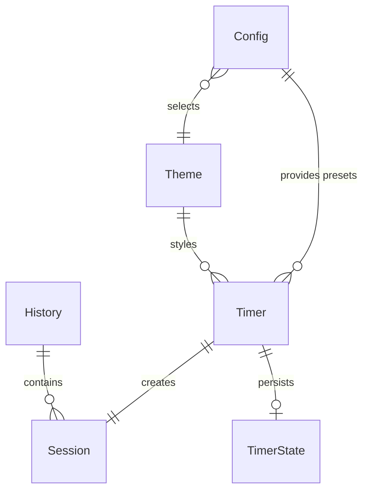

# Information Architecture

**Version:** 1.0  
**Date:** 2026-01-27

## Overview

This document defines the information architecture for Pomodux, including entities, their attributes, relationships, and terminology. This IA provides the data model foundation for the UX specification.

**Source:** [Requirements Data Specifications](../requirements/base.md#data-specifications)

---

## Entities

### Entity 1: Timer

**Purpose:** Represents an active countdown timer instance

**Attributes:**
- `duration` (time.Duration) - Configured timer duration
- `label` (string) - User-provided session label
- `preset` (string) - Preset name used (empty if custom duration)
- `startTime` (time.Time) - When timer started
- `pausedAt` (time.Time) - When timer was paused (zero if not paused)
- `totalPaused` (time.Duration) - Total time spent paused
- `pausedCount` (int) - Number of times paused
- `state` (State enum) - Current timer state

**States:**
- `idle` - Created but not started
- `running` - Actively counting down
- `paused` - Frozen, not counting
- `completed` - Reached 0:00
- `stopped` - Stopped early by user

**Relationships:**
- Uses → Config (for presets and theme)
- Uses → Theme (for styling)
- Creates → Session (on start)
- Persists → TimerState (for crash recovery)

**Source:** [FR-TIMER-001](../requirements/base.md#fr-timer-001), [internal/timer/timer.go](../../internal/timer/timer.go)

---

### Entity 2: Session

**Purpose:** Represents a completed timer session stored in history

**Attributes:**
- `id` (UUID string) - Unique session identifier
- `started_at` (ISO 8601 timestamp) - Session start time (UTC)
- `ended_at` (ISO 8601 timestamp) - Session end time (UTC)
- `duration` (Duration string) - Configured duration (e.g., "25m")
- `preset` (string, optional) - Preset name used (null if custom)
- `label` (string) - Session label/description
- `end_status` (enum string) - Session outcome
- `paused_count` (int) - Number of times paused
- `paused_duration` (Duration string) - Total time spent paused

**End Status Values:**
- `"completed"` - Timer ran to 0:00 successfully
- `"stopped"` - User stopped timer early
- `"cancelled"` - User cancelled with Ctrl+C
- `"interrupted"` - Application crashed or killed

**Relationships:**
- Created from → Timer (on timer start)
- Stored in → History (on completion/stop)

**Source:** [Section 5.2 Session History Schema](../requirements/base.md#52-session-history-schema), [FR-HISTORY-001](../requirements/base.md#fr-history-001)

---

### Entity 3: Config

**Purpose:** Application configuration settings

**Attributes:**
- `version` (string) - Config file version
- `timers` (map[string]string) - Timer presets (name → duration)
- `theme` (string) - Selected theme name
- `timer.bell_on_complete` (bool) - Ring bell on completion
- `logging.level` (string) - Log level (debug/info/warn/error)
- `logging.file` (string) - Log file path (empty = stderr)
- `plugins.enabled` ([]string) - Enabled plugin names
- `plugins.directory` (string) - Plugin directory path

**Relationships:**
- Provides → Timer (presets and theme selection)
- References → Theme (by name)

**Source:** [Section 5.1 Configuration File Schema](../requirements/base.md#51-configuration-file-schema), [FR-CONFIG-001](../requirements/base.md#fr-config-001)

---

### Entity 4: Theme

**Purpose:** Visual theme definition

**Attributes:**
- `name` (string) - Theme name
- `colors.background` (color) - Background color
- `colors.foreground` (color) - Foreground/text color
- `colors.primary` (color) - Primary accent color
- `colors.secondary` (color) - Secondary accent color
- `colors.success` (color) - Success state color (green)
- `colors.warning` (color) - Warning state color (yellow)
- `colors.error` (color) - Error state color (red)
- `colors.border` (color) - Border color
- `colors.progress_filled` (color) - Progress bar filled color
- `colors.progress_empty` (color) - Progress bar empty color
- `colors.text_muted` (color) - Muted/secondary text color
- `progress.filled_char` (string) - Progress bar filled character (e.g., "█")
- `progress.empty_char` (string) - Progress bar empty character (e.g., "░")
- `progress.show_percentage` (bool) - Show percentage on progress bar
- `border.style` (string) - Border style (rounded/square/double/none)

**Relationships:**
- Selected by → Config (theme selection)
- Applied to → Timer (TUI display)

**Source:** [Section 5.4 Theme Definition Schema](../requirements/base.md#54-theme-definition-schema), [FR-CONFIG-003](../requirements/base.md#fr-config-003), [internal/theme/theme.go](../../internal/theme/theme.go)

---

### Entity 5: History

**Purpose:** Collection of completed sessions

**Attributes:**
- `version` (string) - History file format version
- `sessions` ([]Session) - Array of session records

**Relationships:**
- Contains → Sessions (many)

**Source:** [Section 5.2 Session History Schema](../requirements/base.md#52-session-history-schema), [FR-HISTORY-001](../requirements/base.md#fr-history-001)

---

### Entity 6: TimerState

**Purpose:** Persisted timer state for crash recovery

**Attributes:**
- `version` (string) - State file format version
- `session_id` (UUID string) - Session ID
- `pid` (int) - Process ID (for crash detection)
- `started_at` (ISO 8601 timestamp) - Session start time
- `duration` (Duration string) - Configured duration
- `preset` (string, optional) - Preset name
- `label` (string) - Session label
- `remaining` (Duration string) - Time remaining at last update
- `is_paused` (bool) - Current pause state
- `paused_count` (int) - Number of pauses
- `paused_duration` (Duration string) - Total paused time
- `last_updated` (ISO 8601 timestamp) - Last state save time

**Relationships:**
- Persists → Timer (state snapshot)
- Used to → Resume Timer (on recovery)

**Source:** [Section 5.3 Timer State Schema](../requirements/base.md#53-timer-state-schema), [NFR-REL-001](../requirements/base.md#nfr-rel-001), [internal/timer/state.go](../../internal/timer/state.go)

---

## UI Component Architecture

### Component Hierarchy

**Main Window Components (Persistent):**
- Window/Border - Container
- Session Header - Content
- Progress Bar - Content
- Time Display - Content
- Status Indicator - Content

**Overlay Components (Transient):**
- Control Legend - Fades after initial display

**Rationale:**
- Main window components are always visible (persistent)
- Overlay components appear temporarily then fade (transient)
- Control legend is overlay to reduce visual clutter after initial guidance
- Separation allows independent fade behavior without affecting main window

---

## Entity Relationships

### Relationship Diagram



### Relationship Descriptions

**Config → Timer (1:many)**
- Config provides timer presets and theme selection
- Multiple timers can use same config
- Timer reads config on start

**Config → Theme (many:1)**
- Config selects one theme by name
- Theme is loaded based on config selection

**Timer → Session (1:1)**
- Timer creates one session on start
- Session is saved when timer completes or stops

**Timer → TimerState (1:0..1)**
- Timer persists state periodically (every 5s) and on events
- TimerState exists only while timer is active
- TimerState deleted on completion or stop

**History → Session (1:many)**
- History contains multiple session records
- Sessions are appended to history

**Theme → Timer (1:many)**
- Theme is applied to timer TUI display
- Multiple timers use same theme (from config)

---

## Terminology

### Glossary

**Timer**
- The active countdown instance
- Has state (running, paused, etc.)
- Creates session on completion

**Session**
- Completed timer record
- Stored in history
- Represents past timer run

**Preset**
- Named timer duration (work, break, etc.)
- Defined in config file
- Provides quick timer start

**Label**
- User-provided session description
- Displayed in TUI and history
- Defaults to prettified preset name if omitted

**State**
- Internal timer state (idle, running, paused, completed, stopped)
- Used for logic and persistence

**Status**
- Displayed state indicator ("RUNNING", "PAUSED", "COMPLETED")
- Shown in TUI
- Uses semantic colors

**Duration**
- Timer length (e.g., 25m, 1h30m)
- Can be preset or custom
- Maximum 24 hours

**Theme**
- Visual color scheme and styling
- Applied to all UI elements
- Configurable per user

### Terminology Consistency

**Consistent Usage:**
- ✅ "Timer" always refers to active countdown
- ✅ "Session" always refers to completed record
- ✅ "Preset" always refers to named duration
- ✅ "State" vs "Status" distinction maintained (state=internal, status=displayed)


---

## Data Flow

### Data Flow Overview

```
User Input (CLI)
    ↓
Config Load
    ↓
Timer Creation (with preset/duration + label)
    ↓
Timer Start
    ↓
TimerState Persistence (every 5s + events)
    ↓
Timer Running/Paused (state changes)
    ↓
Timer Completion/Stop
    ↓
Session Creation
    ↓
History Append
    ↓
TimerState Cleanup
```

### Data Transformation Points

**1. Config → Timer Preset Resolution**
- Config provides preset map: `{"work": "25m"}`
- Timer resolves preset name to duration
- Duration parsed to `time.Duration`

**2. Timer → Session Creation**
- Timer state converted to Session record
- Duration formatted as string ("25m")
- Timestamps converted to ISO 8601
- End status determined from timer state

**3. Timer → TimerState Persistence**
- Timer state serialized to JSON
- Remaining time calculated and formatted
- Timestamps converted to ISO 8601
- State saved atomically

**4. TimerState → Timer Recovery**
- TimerState loaded from JSON
- Duration parsed from string
- Timestamps parsed from ISO 8601
- Timer state reconstructed

---

## References

### Requirements
- [Section 5.1 Configuration File Schema](../requirements/base.md#51-configuration-file-schema)
- [Section 5.2 Session History Schema](../requirements/base.md#52-session-history-schema)
- [Section 5.3 Timer State Schema](../requirements/base.md#53-timer-state-schema)
- [Section 5.4 Theme Definition Schema](../requirements/base.md#54-theme-definition-schema)
- [FR-TIMER-001](../requirements/base.md#fr-timer-001) - Timer Start
- [FR-CONFIG-001](../requirements/base.md#fr-config-001) - Config Loading
- [FR-HISTORY-001](../requirements/base.md#fr-history-001) - Session Persistence

### Code
- [Timer Implementation](../../internal/timer/timer.go)
- [Timer State](../../internal/timer/state.go)
- [Config Implementation](../../internal/config/config.go)
- [Theme Implementation](../../internal/theme/theme.go)

### Analysis

---

**Last Updated:** 2026-01-27
