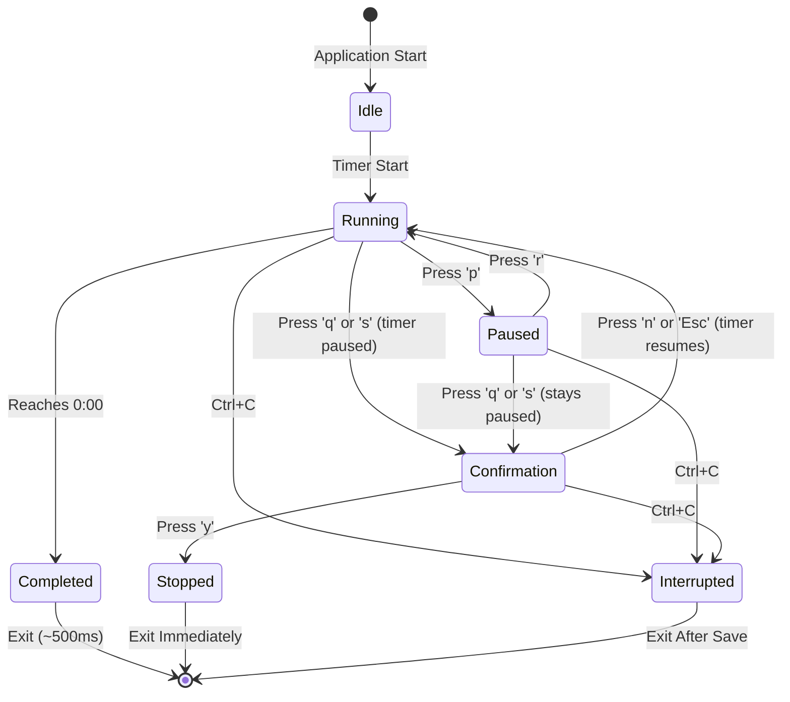
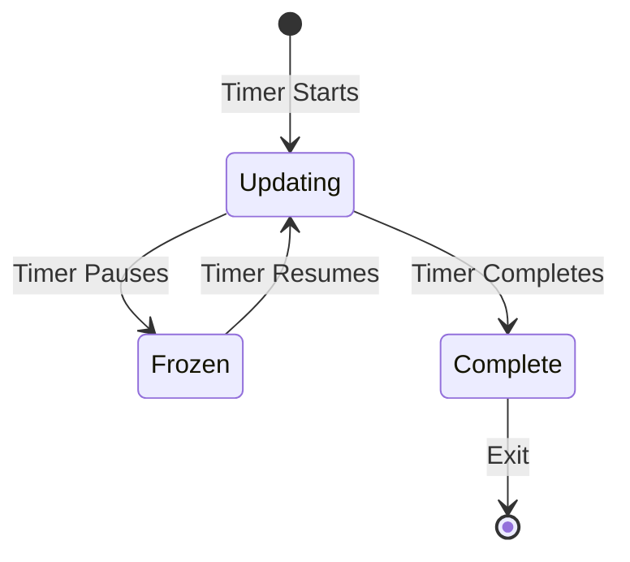
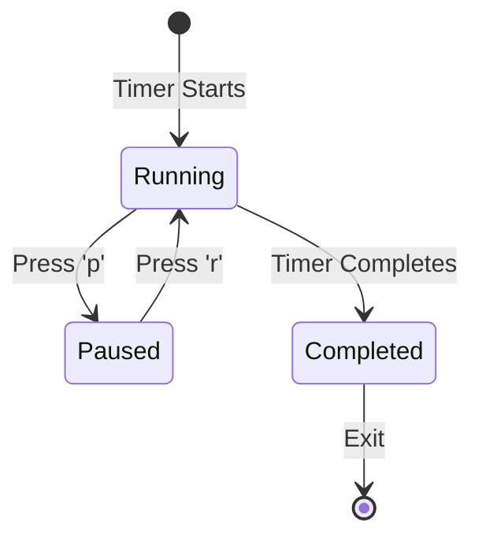
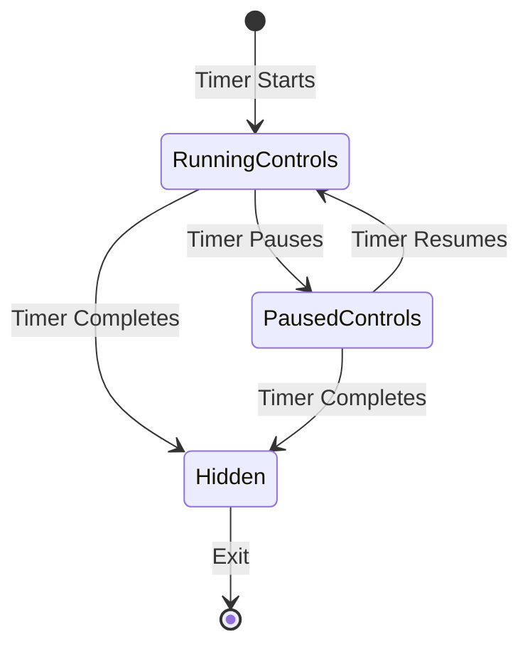

# State Machine Specifications

**Version:** 1.0  
**Date:** 2026-01-27

## Overview

This document provides formal state machine specifications for the Pomodux application and its components. State machines define all possible states, transitions, and transition triggers.

**Source:** [internal/timer/timer.go](../../internal/timer/timer.go), [Components](components.md)

---

## Application State Machine

### State Diagram

**Source:** [internal/timer/timer.go](../../internal/timer/timer.go)

---

### State Definitions

#### State: Idle

**Description:** Timer created but not started

**Properties:**
- Timer exists but not running
- Not displayed in TUI (CLI phase)
- Ready to start

**Data:**
- `duration`: Configured duration
- `label`: Session label
- `preset`: Preset name (if used)
- `state`: "idle"

**Transitions:**
- To Running: Timer.Start() called

**Source:** [internal/timer/timer.go](../../internal/timer/timer.go#L12)

---

#### State: Running

**Description:** Timer actively counting down

**Properties:**
- Timer counting down
- Updates every 250ms
- State persistence every 5s
- Progress bar animating

**Data:**
- `startTime`: When timer started
- `state`: "running"
- `remaining`: Calculated from `time.Since(startTime) - totalPaused`
- `pausedCount`: Number of pauses (0+)
- `totalPaused`: Total paused duration

**Transitions:**
- To Paused: User presses `p`
- To Completed: Timer reaches 0:00
- To Confirmation: User presses `q` or `s` (timer paused automatically, shows confirmation dialog)
- To Interrupted: User presses `Ctrl+C`

**Source:** [internal/timer/timer.go](../../internal/timer/timer.go#L13), [FR-TIMER-001](../requirements/base.md#fr-timer-001)

---

#### State: Paused

**Description:** Timer frozen, not counting

**Properties:**
- Timer frozen at current time
- No countdown updates
- State saved on pause event
- Progress bar frozen

**Data:**
- `state`: "paused"
- `pausedAt`: When timer was paused
- `remaining`: Frozen at pause time
- `pausedCount`: Incremented
- `totalPaused`: Accumulated paused time

**Transitions:**
- To Running: User presses `r`
- To Confirmation: User presses `q` or `s` (stays paused, shows confirmation dialog)
- To Interrupted: User presses `Ctrl+C`

**Source:** [internal/timer/timer.go](../../internal/timer/timer.go#L14), [FR-TIMER-002](../requirements/base.md#fr-timer-002)

---

#### State: Confirmation

**Description:** Confirmation dialog for stop action

**Properties:**
- Overlay dialog displayed (takes over entire timer)
- Timer is paused (automatically paused when dialog appears)
- Modal: Blocks other input
- Main window dimmed/backgrounded
- User confirms or cancels

**Data:**
- `state`: "paused" (timer paused automatically)
- `confirmationShown`: true
- Timer data preserved (time remaining, etc.)

**Transitions:**
- To Running: User presses `n`, `N`, or `Esc` (timer resumes/unpauses)
- To Stopped: User presses `y` or `Y` (confirm stop)
- To Interrupted: User presses `Ctrl+C` (emergency exit, bypasses confirmation)

**Source:** [US-1.4](../requirements/base.md#us-14), [FR-TIMER-003](../requirements/base.md#fr-timer-003)

---

#### State: Completed

**Description:** Timer reached 0:00

**Properties:**
- Timer completed successfully
- Brief display (~500ms)
- Session saved
- Then exits

**Data:**
- `state`: "completed"
- `remaining`: 0
- `end_status`: "completed"

**Transitions:**
- To Exit: After ~500ms display

**Source:** [internal/timer/timer.go](../../internal/timer/timer.go#L15), [FR-TIMER-004](../requirements/base.md#fr-timer-004)

---

#### State: Stopped

**Description:** User stopped timer early

**Properties:**
- Timer stopped before completion
- No display (immediate exit)
- Session saved

**Data:**
- `state`: "stopped"
- `end_status`: "stopped"
- `remaining`: Time remaining when stopped

**Transitions:**
- To Exit: Immediately

**Source:** [internal/timer/timer.go](../../internal/timer/timer.go#L16), [FR-TIMER-003](../requirements/base.md#fr-timer-003)

---

#### State: Interrupted

**Description:** Emergency exit (Ctrl+C)

**Properties:**
- Application interrupted
- State saved for recovery
- Event emitted
- Then exits

**Data:**
- `state`: Saved in TimerState file
- `end_status`: "interrupted" (if not recoverable)
- State file persists for recovery

**Transitions:**
- To Exit: After state save

**Source:** [NFR-REL-001](../requirements/base.md#nfr-rel-001), [FR-PLUGIN-001](../requirements/base.md#fr-plugin-001)

---

### State Transitions

#### Transition: Idle → Running

**Trigger:** Timer.Start() called

**Conditions:**
- Timer state is "idle"
- Valid duration and label

**Actions:**
- Set `startTime = time.Now()`
- Set `state = "running"`
- Emit `TimerStarted` event
- Save state (event-driven)
- Start periodic state saves (every 5s)

**Source:** [internal/timer/timer.go](../../internal/timer/timer.go#L54-L62)

---

#### Transition: Running → Paused

**Trigger:** User presses `p` key

**Conditions:**
- Timer state is "running"

**Actions:**
- Set `pausedAt = time.Now()`
- Increment `pausedCount`
- Set `state = "paused"`
- Emit `TimerPaused` event
- Save state (event-driven)
- Stop periodic state saves

**Source:** [internal/timer/timer.go](../../internal/timer/timer.go#L64-L74), [US-1.3](../requirements/base.md#us-13)

---

#### Transition: Paused → Running

**Trigger:** User presses `r` key

**Conditions:**
- Timer state is "paused"

**Actions:**
- Update `totalPaused += time.Since(pausedAt)`
- Clear `pausedAt`
- Set `state = "running"`
- Emit `TimerResumed` event
- Save state (event-driven)
- Resume periodic state saves (every 5s)

**Source:** [internal/timer/timer.go](../../internal/timer/timer.go#L76-L87), [US-1.3](../requirements/base.md#us-13)

---

#### Transition: Running → Completed

**Trigger:** Timer reaches 0:00

**Conditions:**
- Timer state is "running"
- `Remaining() == 0`

**Actions:**
- Set `state = "completed"`
- Emit `TimerCompleted` event
- Save session with `end_status: "completed"`
- Optional: Ring terminal bell (if configured)
- Clean up state file
- Show completion message (~500ms)
- Exit TUI

**Source:** [internal/timer/timer.go](../../internal/timer/timer.go#L118-L121), [FR-TIMER-004](../requirements/base.md#fr-timer-004)

---

#### Transition: Running/Paused → Stopped

**Trigger:** User presses `q` key (or `s` alias - both work, only `q` displayed)

**Conditions:**
- Timer state is "running" or "paused"

**Actions:**
- Set `state = "stopped"`
- Emit `TimerStopped` event
- Save session with `end_status: "stopped"`
- Clean up state file
- Exit TUI immediately

**Source:** [internal/timer/timer.go](../../internal/timer/timer.go#L89-L96), [US-1.4](../requirements/base.md#us-14)

---

#### Transition: Any → Interrupted

**Trigger:** User presses `Ctrl+C`

**Conditions:**
- Any timer state

**Actions:**
- Save state (critical, for recovery)
- Emit `ApplicationInterrupted` event
- Exit TUI immediately

**Source:** [FR-PLUGIN-001](../requirements/base.md#fr-plugin-001), [NFR-REL-001](../requirements/base.md#nfr-rel-001)

---

## Component State Machines

### Component: Progress Bar

**States:**
- **Updating:** Progress bar animating (running state)
- **Frozen:** Progress bar frozen (paused state)
- **Complete:** Progress bar 100% filled (completed state)

**State Diagram:**

**Transitions:**
- Updating → Frozen: Timer state changes to "paused"
- Frozen → Updating: Timer state changes to "running"
- Updating → Complete: Timer reaches 0:00

**Source:** [Component: Progress Bar](components.md#component-3-progress-bar)

---

### Component: Status Indicator

**States:**
- **Running:** "RUNNING" (green)
- **Paused:** "⏸ PAUSED" (yellow)
- **Completed:** "✓ COMPLETED" (green)

**State Diagram:**

**Transitions:**
- Running → Paused: Timer state changes to "paused"
- Paused → Running: Timer state changes to "running"
- Running → Completed: Timer reaches 0:00

**Source:** [Component: Status Indicator](components.md#component-5-status-indicator)

---

### Component: Control Legend

**States:**
- **Running Controls:** Shows pause, stop, quit
- **Paused Controls:** Shows resume, stop, quit
- **Hidden:** Not shown (completed state)

**State Diagram:**

**Transitions:**
- Running Controls → Paused Controls: Timer state changes to "paused"
- Paused Controls → Running Controls: Timer state changes to "running"
- Any → Hidden: Timer completes

**Source:** [Component: Control Legend](components.md#component-6-control-legend)

---

## State Synchronization

### Application State → Component States

**Synchronization Pattern:**
- Application state drives component states
- Component states update immediately on application state change
- No independent component state management
- Single source of truth (application state)

**Mapping:**
- Application "running" → Progress Bar "Updating", Status "Running", Legend "Running Controls"
- Application "paused" → Progress Bar "Frozen", Status "Paused", Legend "Paused Controls"
- Application "completed" → Progress Bar "Complete", Status "Completed", Legend "Hidden"

**Update Timing:**
- Component states update synchronously with application state
- No delay or animation
- Immediate visual feedback

**Source:** [Components](components.md), [State Machines](state-machines.md)

---

## State Data

### State Persistence

**Persisted States:**
- Running: Saved every 5s (periodic) + on events
- Paused: Saved on pause event (event-driven)
- Interrupted: Saved on interrupt (critical)

**Not Persisted:**
- Idle: Not persisted (no active timer)
- Completed: Not persisted (session saved, state cleaned up)
- Stopped: Not persisted (session saved, state cleaned up)

**State File Format:**
- JSON format
- TimerState schema
- Atomic writes (temp file + rename)

**Source:** [Section 5.3 Timer State Schema](../requirements/base.md#53-timer-state-schema), [NFR-REL-001](../requirements/base.md#nfr-rel-001)

---

## References

### Requirements
- [FR-TIMER-001](../requirements/base.md#fr-timer-001) through [FR-TIMER-004](../requirements/base.md#fr-timer-004)
- [NFR-REL-001](../requirements/base.md#nfr-rel-001) - Crash Recovery
- [FR-PLUGIN-001](../requirements/base.md#fr-plugin-001) - Event System

### Code
- [Timer Implementation](../../internal/timer/timer.go)
- [Timer State](../../internal/timer/state.go)
- [State Enum](../../internal/timer/timer.go#L9-L17)

### Components
- [Component: Progress Bar](components.md#component-3-progress-bar)
- [Component: Status Indicator](components.md#component-5-status-indicator)
- [Component: Control Legend](components.md#component-6-control-legend)

### Analysis

---

**Last Updated:** 2026-01-27
